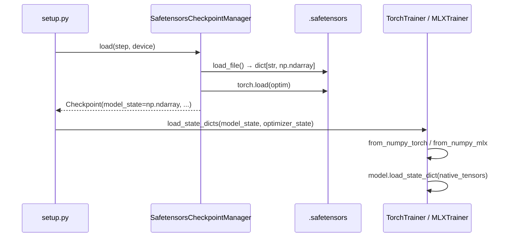

# Checkpoint Interop

Nanochat abstracts checkpoint I/O behind a `CheckpointManager` protocol. Two implementations
exist: `TorchCheckpointManager` for single-backend runs and `SafetensorsCheckpointManager`
for cross-backend weight exchange between `TorchTrainer` and `MLXTrainer`.

---

## Protocol

```python
class CheckpointManager(Protocol):
    def save(self, state, model_state, optimizer_state, rank=0) -> None: ...
    def load(self, step, device, load_optimizer=False, rank=0) -> Checkpoint: ...
    def find_last_step(self) -> int: ...
    def exists(self, step: int) -> bool: ...
    @property
    def checkpoint_dir(self) -> str: ...
```

`Checkpoint` carries `step`, `model_state`, `optimizer_state`, and `metadata`.
`CheckpointMetadata` carries `step`, `model_config`, `user_config`, `val_bpb`,
`loop_state`, and `dataloader_state_dict`.

Select the implementation via `CheckpointConfig.format`:

```toml
format = "torch"        # default — .pt files, single-backend
format = "safetensors"  # cross-backend interop
```

---

## Implementations

| | `TorchCheckpointManager` | `SafetensorsCheckpointManager` |
|---|---|---|
| Model weights | `model_NNNNNN.pt` (torch tensors) | `model_NNNNNN.safetensors` (numpy arrays) |
| Optimizer state | `optim_NNNNNN_rankN.pt` | `optim_NNNNNN_rankN.pt` |
| Metadata | `meta_NNNNNN.json` | `meta_NNNNNN.json` |
| `load()` model state type | `dict[str, torch.Tensor]` | `dict[str, np.ndarray]` |
| Cross-backend | ✗ | ✓ |

---

## Conversion boundary

The manager is the conversion boundary. `SafetensorsCheckpointManager.load()` always returns
`dict[str, np.ndarray]` for model state — numpy is the common currency both frameworks consume.
Each trainer's `load_state_dicts` converts from numpy to its native type.

```
disk (.safetensors)  →  manager.load()  →  dict[str, np.ndarray]
                                                    ↓
                          TorchTrainer.load_state_dicts()  →  torch.Tensor  (via from_numpy_torch)
                          MLXTrainer.load_state_dicts()    →  mx.array      (via from_numpy_mlx)
```

Saving is the mirror: each trainer's `model_state_dict()` returns its native type, and
`convert.to_numpy()` is called by the manager before writing to disk.

### Save flow

```mermaid
sequenceDiagram
    participant Loop as loop.py
    participant Trainer as TorchTrainer / MLXTrainer
    participant Manager as SafetensorsCheckpointManager
    participant Disk as .safetensors

    Loop->>Trainer: model_state_dict()
    Trainer-->>Loop: dict[str, Tensor | mx.array]
    Loop->>Manager: save(state, model_state, optimizer_state)
    Manager->>Manager: to_numpy(model_state)
    Manager->>Disk: save_file(numpy_dict)
    Manager->>Disk: torch.save(optimizer_state)
    Manager->>Disk: meta_NNNNNN.json
```

### Load flow



---

## `convert.py`

| Function | Input | Output |
|---|---|---|
| `to_numpy(state_dict)` | `torch.Tensor` or `mx.array` or `np.ndarray` | `dict[str, np.ndarray]` |
| `from_numpy_torch(state_dict)` | `dict[str, np.ndarray]` | `dict[str, torch.Tensor]` |
| `from_numpy_mlx(state_dict)` | `dict[str, np.ndarray]` | `dict[str, mx.array]` |

`from_numpy_mlx` lazily imports `mlx.core` — safe to import on non-Darwin systems.

---

## Optimizer state note

Optimizer state is saved with `torch.save` / `torch.load` in both managers. Optimizer tensors
are framework-specific and not shared across backends, so the torch pickle format is acceptable.
A future improvement would split optimizer state into tensor buffers (`.safetensors`) and scalar
metadata (JSON) to remove the torch dependency from `SafetensorsCheckpointManager` entirely.

---

## Factory

```python
from nanochat.checkpoint import make_checkpoint_manager
from nanochat.config.checkpoint import CheckpointConfig

manager = make_checkpoint_manager(ckpt_dir, CheckpointConfig(format="safetensors"))
```
