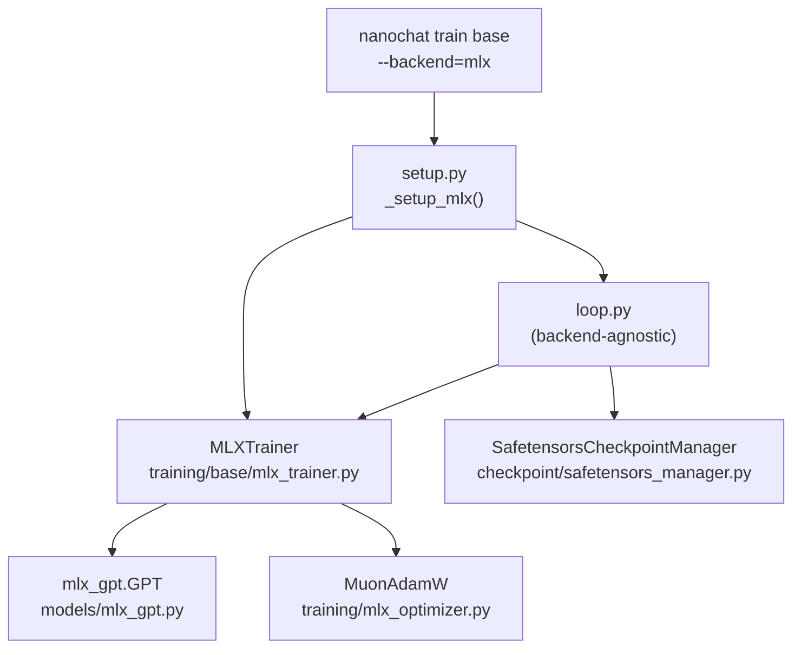

# MLX Backend

The MLX backend is a complete Apple Silicon training path that shares `loop.py`, config,
checkpoint format, and evaluation harness with the PyTorch backend. Only the forward/backward
and optimizer step differ.

---

## Stack overview



---

## Components

### `mlx_gpt.GPT`

MLX port of `models/gpt.py`. Shares `GPTConfig`. Training forward pass only (no KV cache).
See [mlx-gpt-design.md](mlx-gpt-design.md) for architecture mapping and attention details.

### `MuonAdamW` (MLX)

MLX port of `training/optimizer.py`. Plain class — not a subclass of `mlx.optimizers.Optimizer`.
Muon groups use `@mx.compile` on `muon_step`. AdamW groups use one `mlx.optimizers.AdamW`
instance per group with `bias_correction=True`.
See [mlx-muon-design.md](mlx-muon-design.md) for op mapping and immutability details.

### `MLXTrainer`

Implements `BaseTrainer`. Owns the model, optimizer, accumulation loop, and loader.

Key behaviors:
- Grad accumulation via lazy N-call approach: `_LossAndGrad` compiled once, called N
  times without per-step `mx.eval`, gradient trees accumulated as lazy expressions,
  single `mx.eval` per optimizer step. See [mlx-training-patterns.md](mlx-training-patterns.md).
- `mx.eval(model.parameters(), optimizer.state())` after each optimizer step
- `forward_logits` uses `mx.stop_gradient`
- `load_state_dicts` accepts numpy arrays (safetensors manager output) via `from_numpy_mlx`
- NaN guard: if `loss` is non-finite, `step()` skips the optimizer update to preserve
  model weights

---

## Training step — MLX call sequence

```mermaid
sequenceDiagram
    participant Loop as loop.py
    participant T as MLXTrainer
    participant F as _LossAndGrad (compiled)
    participant M as mlx_gpt.GPT
    participant O as MuonAdamW

    Loop->>T: forward_backward()
    T->>F: loss_and_grad(x1, y1)  ← lazy, no mx.eval
    F-->>T: loss1, grads1 (lazy)
    T->>F: loss_and_grad(x2, y2)  ← lazy, no mx.eval
    F-->>T: loss2, grads2 (lazy)
    note over T: repeat N times; accumulate grads via tree_map(a+b)
    T->>T: mx.eval(losses, mean_grads)  ← single sync for all N microbatches
    T-->>Loop: StepResult(loss, loader_state)

    Loop->>T: step(lr_multiplier, momentum, weight_decay)
    T->>T: update group["lr"] = initial_lr * lr_multiplier
    T->>O: update(model, mean_grads)
    O->>M: model.update(new_params)
    T->>T: mx.eval(model.parameters(), optimizer.state())
```

---

## Setup path

`setup.py` dispatches to `_setup_mlx()` when `backend == "mlx"`:

- Skips `compute_init`, DDP, `torch.compile`, `GradScaler`, FP8
- Builds `mlx_gpt.GPT` from `GPTConfig` (shared with torch path)
- Builds `MuonAdamW` via `build_param_groups`
- Wraps the torch dataloader with a converter: `torch.Tensor → mx.array`
- Returns `device_type="mlx"`, `ddp_rank=0`, `ddp_world_size=1`

The torch meta model is still used for param counting and scaling law calculations —
it's framework-agnostic (shapes only, no data).

---

## Checkpoint interop

Use `format = "safetensors"` to exchange checkpoints between backends:

```toml
[checkpoint]
format = "safetensors"
```

`SafetensorsCheckpointManager.load()` returns `dict[str, np.ndarray]`.
`MLXTrainer.load_state_dicts` converts via `from_numpy_mlx`.
See [checkpoint-interop.md](checkpoint-interop.md) for the full conversion boundary.
